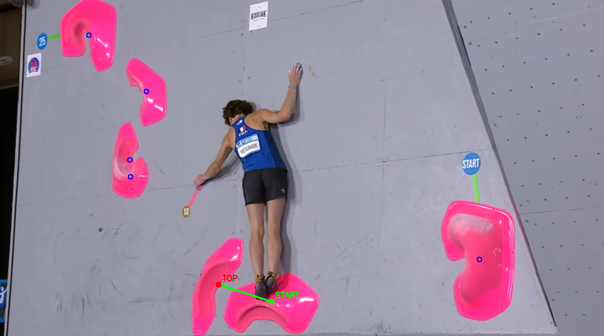

# 🧗 Climbing Route Detection & Prediction with YOLOv8

This project uses a custom-trained YOLOv8 model to detect climbing holds from an image and predict a climbing route based on proximity. It allows you to interactively select a starting point by clicking on the image, then builds a climbable route from that point.

---

## 📦 Features

- 🧠 **Hold Detection** using YOLOv8
- 🖱️ **Interactive Start Hold Selection**
- 🔄 **Route Prediction Based on Distance**
- 🖼️ **Visual Output with Annotated Route**

---

## 🛠 Requirements

- Python 3.8+
- [Ultralytics YOLOv8](https://github.com/ultralytics/ultralytics)
- OpenCV

## 🚀 Usage

1. Prepare Input
- Place an image in the route_examples/ folder.
- Ensure your YOLOv8 weights are saved at: runs/detect/train2/weights/best.pt.

2. Run the Script

`python climbing_route_prediction.py`

## Authors
* Umut Tulay - [umutulay](https://github.com/umutulay)
